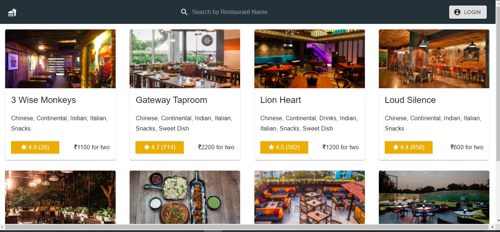
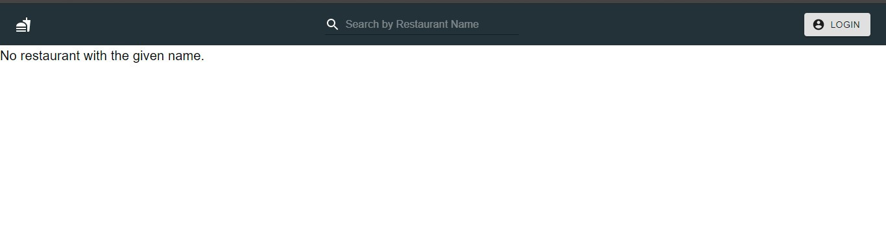
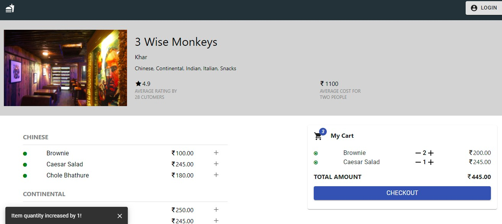
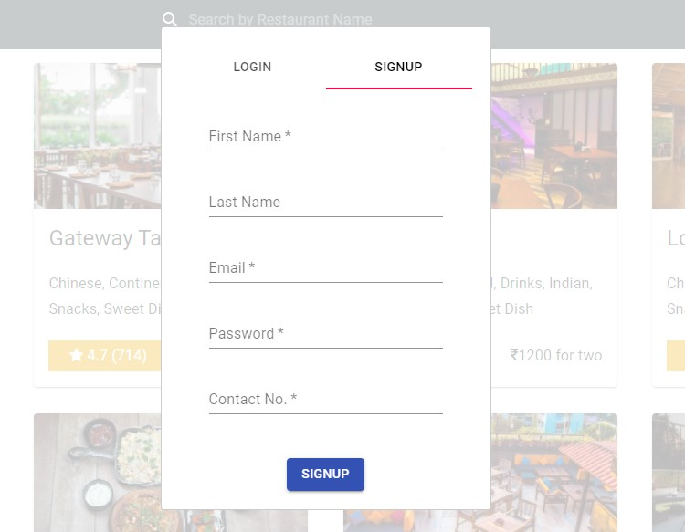
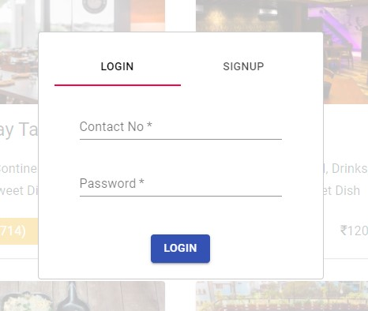
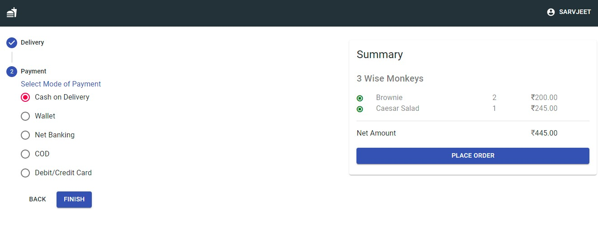
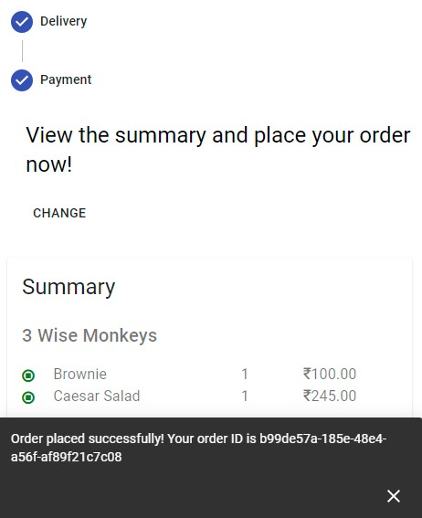

> # FoodOrderingApp - Frontend
>
> - Food Ordering App is a web application, which is created with the basic idea to allow a customer browse restaurants
>   and order menu items from that restaurant.

&#10004; Feature Header.js was complete and profile integrtaion was working fine.

> - Clone the [repo](https://github.com/sandeepraina-dsd19/FoodOrderingApp-Frontend.git)
> - RUN `npm install`
> - RUN `npm start`

_If your backend is running you should see below page_

*If your backend is not running the below page will render*

_Once the Page is loaded, click on your favourate hotel to order the food_

_After adding the food to the cart_

> _If not signed up !!_ 
 >_Please Sign Up_  
>   
 > _Else, Login_  
> 

_Once signup is done,  Go to cart and checkout _
  
_Add payment and complete your order,  You will prompted with order Id ,  Once the order is successfully placed._

